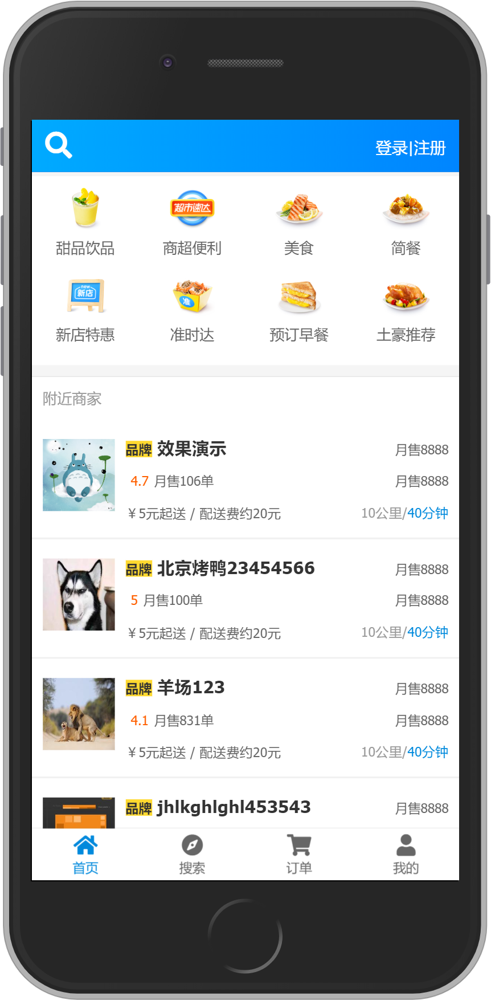
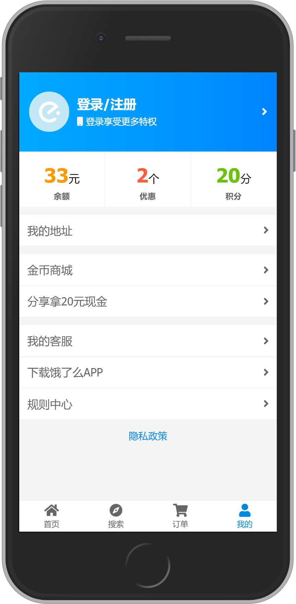

# VueEleApp  
Vue-cli3 构建饿了么

## 项目介绍  
这个项目使用Vue2.x版本，构建使用cli3。是对[vue2-elm](https://github.com/bailicangdu/vue2-elm)项目的重写。后台数据接口使用的是[node-elm](https://github.com/bailicangdu/node-elm)项目的接口。非常感谢这个大佬开源的几个项目。对于刚入门前端没有后台经验的我来说非常适用。布局方面使用的方案是viewport布局，此前项目使用的rem布局。偶然发现一个很好用的px转vw的插件[postcss-px-to-view](https://github.com/evrone/postcss-px-to-viewport).所以立马在这个项目试试水，移动端太多坑，希望这个插件好用。学习vue也有一段时间了，但是对于状态管理，也就是Vuex的应用还差点意思，尤其是在一些涉及登录、购车车之类的组件，状态管理非常复杂且尤为重要的地方。这也是为什么我选择重构这个项目的原因。为了提升自己，所以只要有时间会一直写这个项目，写一点算一点。把它提交到github上来，记录自己的学习过程。


## 项目进展  
* 实现搜索地址记录，刷新页面保持登录状态（2019.12.3 更新）
* 实现店铺购物车功能。(2019.11.27 更新)
* 实现账号密码登录，使用vuex管理登录状态及用户信息。 (2019.11.23 更新)
* 封装Toast等插件，添加加载动画，配置Vuex。 (2019.11.18 更新)
* 完成店铺首页布局，使用better-scroll插件实现菜单栏、商品栏联动。（2019.11.13 更新）
* 目前完成了页面的基本布局，包括首页、搜索页、订单页、用户信息页的布局。  
    功能方面，实现了定位到城市，搜索地址等。同时封装了输入框、文本框等组件  （2019.11.8 更新）
    

## 查看线上Demo
地址：[传送门](https://leewayjean.github.io)  


## 项目截图 (部分)  
### ---------home
   

### ---------profile
   


## 项目启动
```
npm install   //安装依赖
```

### 编译、热更新
```
npm run serve
```

### 编译、压缩
```
npm run build
```

### 运行测试
```
npm run test
```
